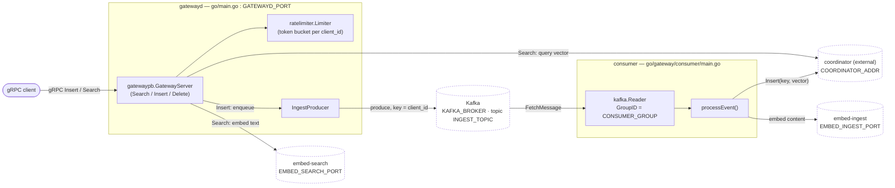
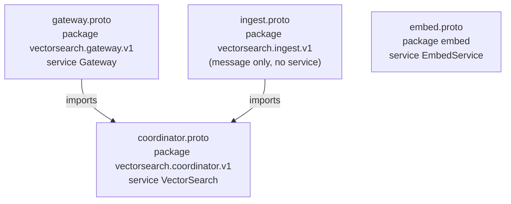
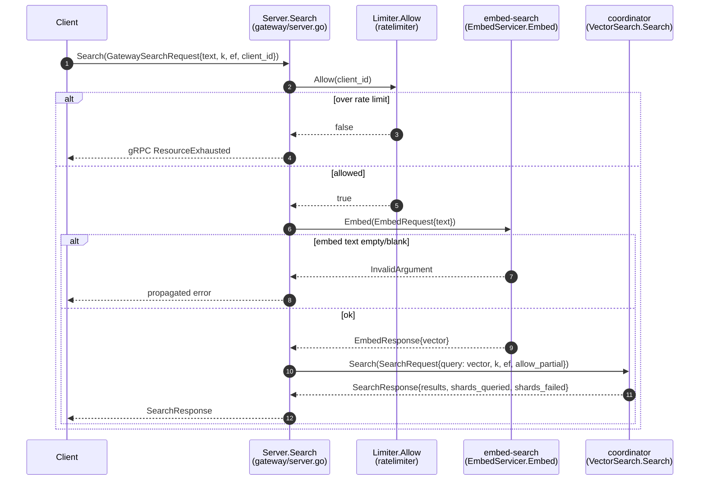
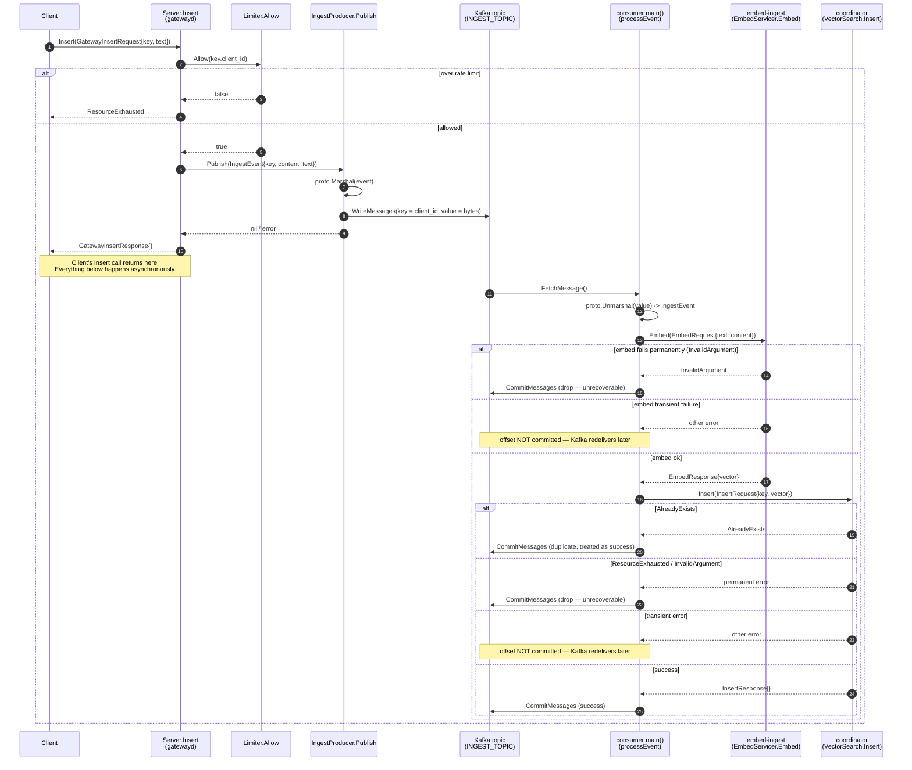
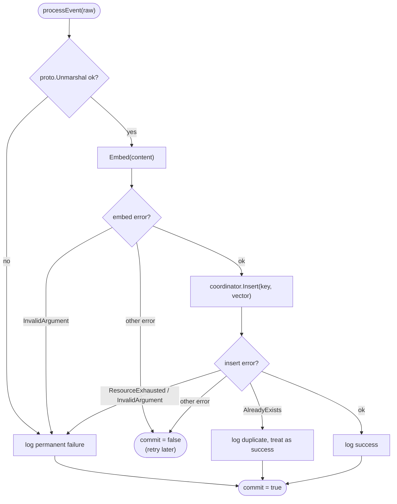
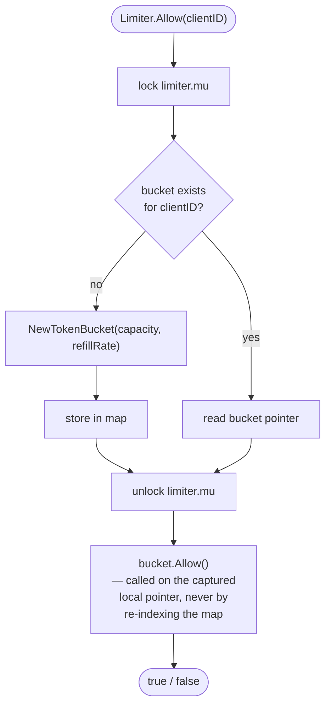
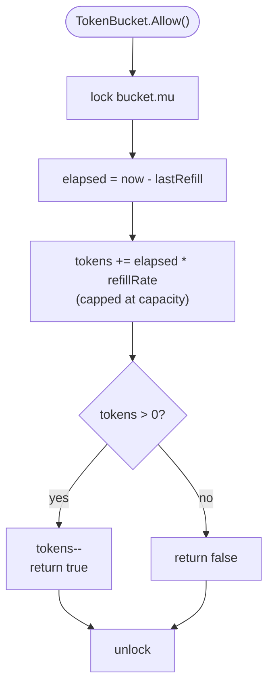
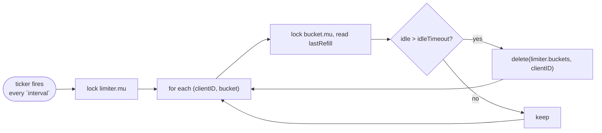
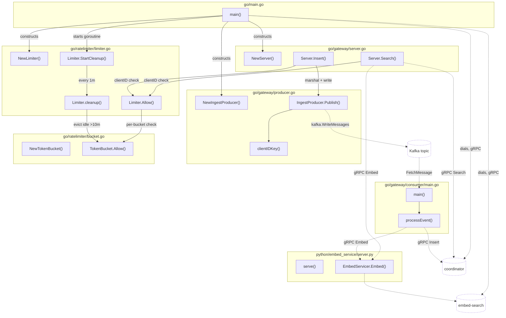
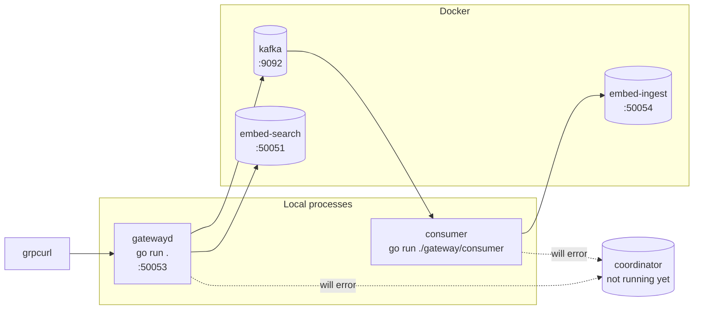

# vectorsearch-gateway — Architecture

This document is the full technical reference for the project: what each service
does, how a request moves through the system end to end, the exact proto
contracts in play, every environment variable, and how to run and test the
whole stack. Diagrams are Mermaid — they render natively on GitHub/GitLab, in
VS Code (with the Mermaid preview extension), and in the published
[Gateway Call Map](https://claude.ai/code/artifact/b03c0d0c-ffd3-4e57-9d06-4a1b62c3b420)
artifact.

---

## 1. What this project is

`vectorsearch-gateway` is the public-facing edge of a vector search system. A
caller sends text; the gateway turns it into an embedding, and either:

- **searches** an existing vector index for nearest neighbours (`Search`), or
- **queues the text for ingestion** into that index, asynchronously, via Kafka
  (`Insert`).

The gateway itself holds no vector index and no ML model — it is a thin,
rate-limited router in front of three other services:

| Service | Language | Role |
|---|---|---|
| **gatewayd** | Go | Public gRPC entrypoint (`Gateway` service). Rate-limits, embeds, routes. |
| **embed service** (x2 instances) | Python (gRPC, `sentence-transformers`) | Turns text into a fixed-size float vector. Run twice — once dedicated to Search traffic, once to Insert/ingest traffic — so a slow bulk-ingest load can't starve interactive search latency. |
| **coordinator** | *external — not in this repo* | Owns the actual vector index. Implements `VectorSearch` (`Insert`, `Search`, `Delete`). |
| **consumer** | Go | Standalone binary. Reads ingest events off Kafka, embeds them (via the ingest-side embed instance), and calls `coordinator.Insert`. This is what actually gets data into the index — `gatewayd.Insert` only enqueues it. |
| **Kafka** | — | Durable queue between "gateway accepted an insert" and "coordinator actually indexed it." Decouples ingest latency from index-write latency. |

> **The coordinator is not part of this repository.** Only its proto contract
> (`proto/coordinator.proto`) and generated Go client stubs
> (`go/proto/coordinatorpb/`) live here. Both `gatewayd` (for `Search`) and
> `consumer` (for the actual `Insert`) dial it as an external dependency at
> `COORDINATOR_ADDR`. Until a real coordinator is running, `Search` and the
> consumer's insert step will fail — everything else in this doc still
> applies.

---

## 2. System architecture



**Why two embed instances instead of one:** `embed-search` and `embed-ingest`
run the same code (`python/embed_service/server.py`) on different ports
(`EMBED_SEARCH_PORT` / `EMBED_INGEST_PORT`). Splitting them means a burst of
ingest traffic saturating its CPU-bound embedding model doesn't add latency to
interactive search requests, and vice versa — they scale independently.

**Why Kafka sits between `Insert` and the coordinator:** `gatewayd.Insert`
returns as soon as the event is durably queued, not once it's indexed. That
keeps the write path fast and decoupled from coordinator/index health — if the
coordinator is briefly down, inserts still succeed at the gateway and drain
once it recovers, instead of every client-facing `Insert` call blocking or
failing.

---

## 3. Proto contracts

Four `.proto` files, one Go package per file (`<name>pb`), imports flow one
direction only: `gateway.proto` and `ingest.proto` import `coordinator.proto`;
`embed.proto` stands alone.



### `coordinator.proto` — the index's own contract

```proto
service VectorSearch {
  rpc Insert (InsertRequest) returns (InsertResponse);
  rpc Delete (DeleteRequest) returns (DeleteResponse);
  rpc Search (SearchRequest) returns (SearchResponse);
}

message Key { uint64 client_id = 1; uint64 label = 2; }
message InsertRequest { Key key = 1; repeated float vector = 2; }
message SearchRequest {
  repeated float query = 1;
  uint32 k = 2;
  uint32 ef = 3;
  bool allow_partial = 4;   // false = any shard failure fails the whole search
}
message SearchResponse {
  repeated ScoredKey results = 1;
  uint32 shards_queried = 2;  // always populated, even on full success
  uint32 shards_failed  = 3;
}
```

`Key` is the identity every vector is stored and searched under —
`client_id` scopes data per tenant, `label` is the caller's own id for that
vector (used to correlate a later `Delete` back to what was inserted).

### `gateway.proto` — the public contract

```proto
service Gateway {
  rpc Insert(GatewayInsertRequest) returns (GatewayInsertResponse);
  rpc Search(GatewaySearchRequest) returns (vectorsearch.coordinator.v1.SearchResponse);
  rpc Delete(vectorsearch.coordinator.v1.DeleteRequest) returns (vectorsearch.coordinator.v1.DeleteResponse);
}

message GatewaySearchRequest {
  string text = 1;
  uint32 k = 2;
  uint32 ef = 3;
  bool allow_partial = 4;
  uint64 client_id = 5;   // added so Search can be rate-limited per caller
}

message GatewayInsertRequest {
  vectorsearch.coordinator.v1.Key key = 1;
  string text = 2;
}
message GatewayInsertResponse {}
```

Callers never send raw vectors — only text. `gatewayd` is what turns text
into the `vector`/`query` fields the coordinator actually needs.

### `ingest.proto` — the Kafka payload

```proto
message IngestEvent {
  vectorsearch.coordinator.v1.Key key = 1;
  string content = 2;
}
```

This is the only thing that goes on the wire in Kafka — `gatewayd.Insert`
protobuf-marshals it into the message value; the consumer unmarshals it back.

### `embed.proto` — the embedding contract

```proto
service EmbedService {
  rpc Embed(EmbedRequest) returns (EmbedResponse);
}
message EmbedRequest { string text = 1; }
message EmbedResponse { repeated float vector = 1; }
```

Implemented once in Python (`sentence-transformers`, model
`all-MiniLM-L6-v2`), run as two separate processes/containers for search vs.
ingest isolation (see §2).

---

## 4. Request flow: `Gateway.Search`

Synchronous, two hops downstream before replying.



Note the response type: `Gateway.Search` returns
`vectorsearch.coordinator.v1.SearchResponse` directly — the gateway does not
wrap or reshape the coordinator's response, it passes it straight through.

---

## 5. Request flow: `Gateway.Insert` → Kafka → consumer → coordinator

This is the full, cross-process, end-to-end ingest path — the part that
actually gets a vector into the index. `Gateway.Insert` itself only does the
first half.



### Why commit/don't-commit is decided per error class

`processEvent` (`go/gateway/consumer/main.go`) returns a bool: *should this
Kafka offset be committed?* The rule is deliberate, not incidental:

- **Commit on permanent failure too** (bad payload, `InvalidArgument`,
  `ResourceExhausted`) — retrying an event that can never succeed would just
  replay the same failure forever and block every later message on that
  partition. Better to log it and move on.
- **Commit on `AlreadyExists`** — the coordinator has effectively already
  done the work; treating a duplicate delivery as success is correct, not a
  bug.
- **Never commit on transient failure** (embed service or coordinator
  temporarily unreachable/overloaded) — leaving the offset uncommitted lets
  Kafka redeliver the same message once the dependency recovers, so no data
  is silently lost.



---

## 6. Rate limiting internals

One token bucket per `client_id`, created lazily on first use, refilled
continuously (not on a fixed tick), and swept for idle entries by a
background goroutine.



> **Why the local pointer matters:** the bucket pointer is read while the
> lock is held, then used *after* unlocking. If `Allow` instead re-indexed
> `l.buckets[clientID]` after unlocking, a concurrent `cleanup()` deleting
> that same idle entry could run in between — the second read would then
> either panic on a nil bucket or silently allocate a fresh, full bucket,
> defeating the rate limit. Capturing the pointer first closes that window.





`main.go` starts this with `limiter.StartCleanup(1*time.Minute,
10*time.Minute)`: sweep every minute, evict any client idle for 10+ minutes —
bounding the map's memory to recently-active clients regardless of how many
distinct `client_id`s have ever connected.

---

## 7. File & function map



| File | Responsibility |
|---|---|
| `go/main.go` | gatewayd entrypoint: load `.env`, dial coordinator + embed-search, build the Kafka producer and rate limiter, serve `Gateway` on `GATEWAYD_PORT`. |
| `go/gateway/server.go` | `Server` struct + `Search`/`Insert` handlers — the only business logic in gatewayd. |
| `go/gateway/producer.go` | `IngestProducer` — marshals an `IngestEvent` and writes it to Kafka, keyed by `client_id` (so all events for one client land on the same partition, preserving per-client order). |
| `go/gateway/consumer/main.go` | Standalone binary: reads Kafka, unmarshals, embeds via embed-ingest, inserts via the coordinator, commits/skips per the error-class rule in §5. |
| `go/ratelimiter/limiter.go` + `bucket.go` | Per-client token-bucket rate limiting, with idle-bucket cleanup. |
| `python/embed_service/server.py` | The embed gRPC server, run twice as `embed-search` and `embed-ingest`. |
| `proto/*.proto` | The four schema files described in §3. |

---

## 8. Environment variables

All read from a single `.env` at the repo root (`godotenv.Load(".env")` in
both Go binaries; Docker Compose reads the same file automatically).

| Variable | Used by | Example | Meaning |
|---|---|---|---|
| `KAFKA_BROKER` | gatewayd, consumer | `localhost:9092` | Kafka bootstrap address. |
| `INGEST_TOPIC` | gatewayd, consumer | `ingest-events` | Topic `Insert` publishes to and the consumer reads from. |
| `CONSUMER_GROUP` | consumer | `ingest-consumers` | Kafka consumer group id — determines offset tracking and horizontal scaling of consumer instances. |
| `EMBED_SEARCH_PORT` | embed-search container, gatewayd | `50051` | Port the search-side embed instance listens on. |
| `EMBED_INGEST_PORT` | embed-ingest container, consumer | `50054` | Port the ingest-side embed instance listens on. |
| `COORDINATOR_ADDR` | gatewayd, consumer | `localhost:50052` | Address of the external coordinator/vector-index service. |
| `GATEWAYD_PORT` | gatewayd | `50053` | Port gatewayd itself listens on. |

Both Go binaries currently derive `embedSearchAddr`/`embedIngestAddr` as
`"localhost:" + PORT` rather than reading a full address — this only works
when everything runs on the host network (see §9). Running gatewayd or the
consumer *inside* a container requires those to resolve by Docker service
name instead (e.g. `embed-search:50051`), which is a follow-up, not yet done.

---

## 9. Running and testing today (hybrid: Docker infra + local Go)

This is the flow actually in use right now — Kafka and the two embed
instances in Docker, `gatewayd` and `consumer` run locally with `go run`, so
`localhost:<port>` addressing resolves correctly. The coordinator is not
running, so `Search` and the consumer's `coordinator.Insert` step will error
out — everything up to that point (rate limiting, embedding, Kafka
produce/consume) is fully exercisable without it.



```bash
# 1. Start Kafka + both embed instances
docker compose up --build
# leave this running in its own terminal

# 2. Start gatewayd (new terminal, from repo root)
cd go
go run .

# 3. Start the consumer (another new terminal)
cd go
go run ./gateway/consumer

# 4. Exercise it with grpcurl (from repo root, another terminal)
grpcurl -plaintext -import-path ./proto -proto gateway.proto localhost:50053 list

# Insert — succeeds; goes gatewayd -> Kafka -> consumer -> embed-ingest -> (fails at coordinator, expected)
grpcurl -plaintext -import-path ./proto -proto gateway.proto \
  -d '{"key":{"client_id":1,"label":42},"text":"hello world, this is a test document"}' \
  localhost:50053 vectorsearch.gateway.v1.Gateway/Insert

# Search — fails at the coordinator step (expected, until it exists)
grpcurl -plaintext -import-path ./proto -proto gateway.proto \
  -d '{"text":"hello world","k":5,"ef":50,"allow_partial":true,"client_id":1}' \
  localhost:50053 vectorsearch.gateway.v1.Gateway/Search

# embed-search / embed-ingest directly
grpcurl -plaintext -import-path ./proto -proto embed.proto \
  -d '{"text":"hello world, this is a test sentence"}' localhost:50051 embed.EmbedService/Embed
grpcurl -plaintext -import-path ./proto -proto embed.proto \
  -d '{"text":"another test sentence"}' localhost:50054 embed.EmbedService/Embed

# 5. Stop everything
# Ctrl+C in the gatewayd terminal, Ctrl+C in the consumer terminal,
# then in the docker compose terminal: Ctrl+C, then
docker compose down
```

One-time setup: `go install github.com/fullstorydev/grpcurl/cmd/grpcurl@latest`.

---

## 10. What full Docker (everything containerized) still needs

Not done yet — listed here so the gap is explicit rather than assumed away:

1. **Dockerfiles for `gatewayd` and `consumer`.** Neither Go binary has one;
   only `python/embed_service/Dockerfile` exists.
2. **Compose services for `gatewayd`, `consumer`, and `coordinator`.**
   `docker-compose.yml` currently only defines `kafka`, `embed-search`,
   `embed-ingest`.
3. **Docker-network addressing.** Once `gatewayd`/`consumer` run as
   containers, `localhost:<port>` no longer reaches sibling containers — the
   env values need to become Compose service names (`kafka:9092`,
   `embed-search:50051`, `embed-ingest:50054`, `coordinator:50052`), which
   means either a second `.env.docker` or per-service `environment:`
   overrides in Compose.
4. **A real coordinator.** This repo only has its proto contract and
   generated client stubs — the server implementation is a separate
   project/image.

## 11. Other known gaps (behavioral, not infra)

- `Gateway.Delete` is declared in `gateway.proto` and forwards to
  `coordinator.Delete` in the schema, but `Server` never implements it — it
  falls through to the generated `UnimplementedGatewayServer.Delete`, which
  always returns `codes.Unimplemented`.
- `go/main.go` dials the `embed-ingest` instance and constructs an
  `EmbedServiceClient` for it that is never used from `gatewayd` — only the
  *consumer* uses the ingest-side embed client. This is intentional (Search
  uses the search-side client only), but worth knowing if you see that dial
  in `main.go` and wonder where its client goes.
