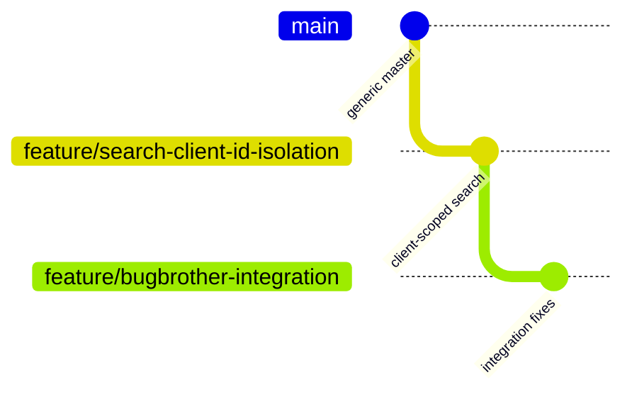
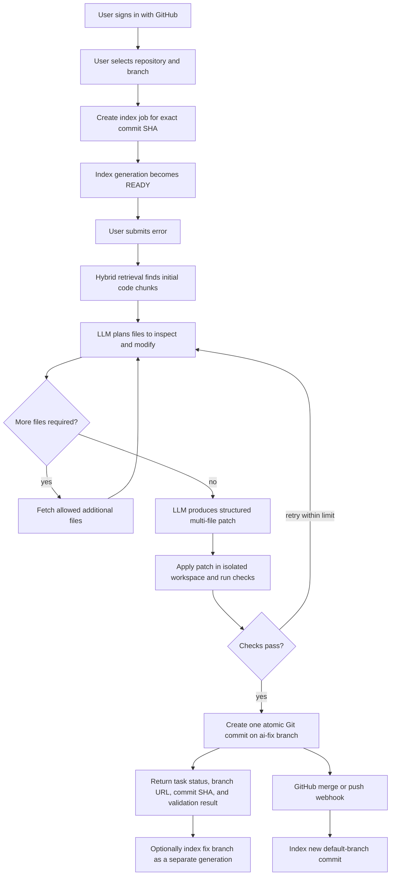
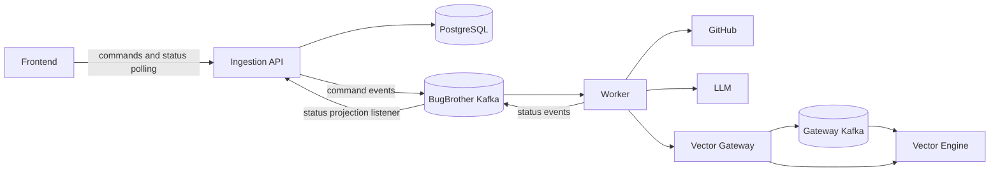
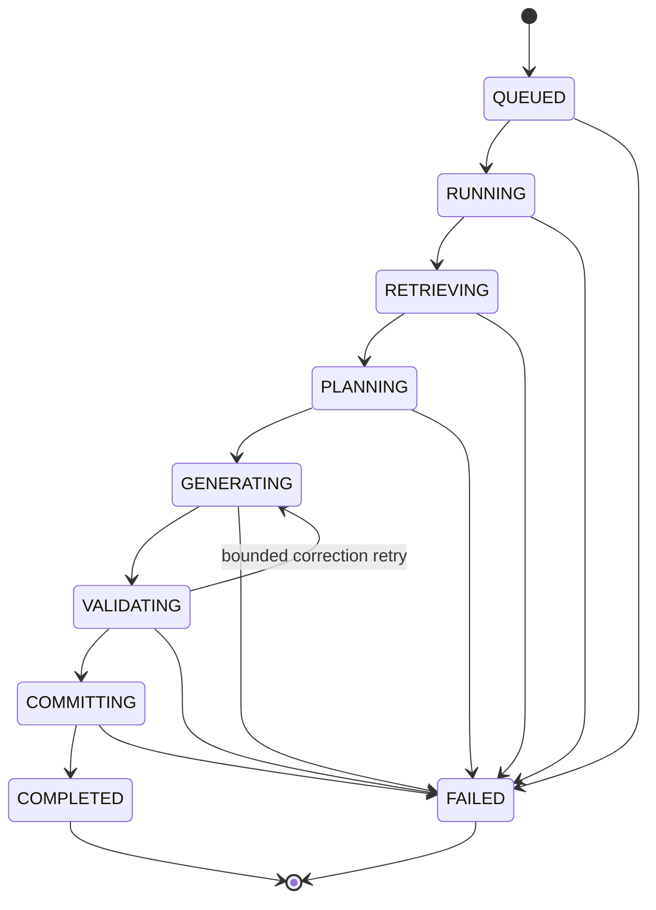

# BugBrother rebuild plan

> Created: 12 September 2026  
> Purpose: a learning-oriented implementation plan for connecting BugBrother, vectorsearch-gateway, and VectorSearchEngine reliably.  
> Constraint: this document is a plan only. It does not authorize or contain implementation changes.

## 1. Ground rules

1. Keep `master` in `vectorsearch-gateway` and `VectorSearchEngine` unchanged. BugBrother-related vector integration work stays on their dedicated feature branches until it is independently reviewed and intentionally merged. BugBrother application work continues directly on its `master` branch, as explicitly chosen for this project.
2. Write and understand each change manually. Use this plan as the order of work, the file map, and the acceptance checklist.
3. Finish one phase and pass its acceptance checks before starting the next phase.
4. Preserve the current working system as a baseline. Do not combine architecture repair, UI redesign, new language support, and production security in one change.
5. Every asynchronous operation must eventually have an observable terminal state: `COMPLETED` or `FAILED`.
6. A successful HTTP `202` means only “accepted.” It must never be displayed as “fixed” or “indexed.”
7. Repository content must always be associated with an immutable Git commit SHA. Owner, repository name, and branch alone are not sufficient versions.

## 2. Branch strategy

Current inspected state:

| Repository | Current branch/commit | Plan |
|---|---|---|
| BugBrother | `master` at `6eea4f2` (`RAG phase1`), clean | Continue implementation on `master` |
| vectorsearch-gateway | `feature/search-client-id-isolation` at `5ace330` | Continue BugBrother integration work here or create a child branch from it |
| VectorSearchEngine | `feature/search-client-id-isolation` at `198ae05` | Continue BugBrother integration work here or create a child branch from it |

Recommended branch relationship:



Use this branch relationship independently in each vector repository. BugBrother remains on `master`. Do not merge vector changes or push any repository merely because a phase compiles; first run that phase's acceptance test.

## 3. Target behavior

The completed workflow should be:



The default branch index must not be overwritten with code from an unmerged fix branch. Each branch and commit gets its own index generation.

## 4. Main architectural decisions

### 4.1 Keep two Kafka responsibilities separate

Use BugBrother Kafka for workflow commands and status events. Use gateway Kafka only for vector ingestion.

```text
BugBrother Kafka:
  code-guardian-index-tasks
  code-guardian-debug-tasks
  code-guardian-task-events
  code-guardian-dead-letter

Gateway Kafka:
  ingest-events
```

They may run on the same physical broker later, but treat them as logically separate systems. For the first reliable local deployment, keeping two brokers reduces accidental coupling and makes ownership clearer.

### 4.2 Add a workflow database owned by the ingestion service

Use PostgreSQL as the source of truth for jobs, index generations, manifests, and user-visible status. The worker should publish status events; the ingestion service consumes those events and updates its database.

The frontend reads status only from the ingestion API. It never connects directly to Kafka, the worker, gateway, or database.

### 4.3 Use index generations instead of in-place HNSW update first

An HNSW upsert is difficult because replacing a vector can invalidate its graph connections. The existing engine also does not allow reusing a deleted key. Avoid making this the first engine change.

For each repository branch and commit, create a new generation:

```text
vector client_id = hash(githubRepositoryId, branch, generationId)
vector label     = hash(filePath, chunkIdentity)
```

All searches use only the active `READY` generation's `client_id`. Changed and deleted files therefore cannot leak from the previous generation. Once a new generation is complete, activate it atomically in PostgreSQL.

Old generations can be garbage-collected later through the existing key manifest and a working `Gateway.Delete` implementation.

### 4.4 Store retrieval metadata outside the vector engine

The engine should continue storing numeric keys and vectors. BugBrother PostgreSQL stores the mapping:

```text
generation + vector label
  -> repository ID
  -> branch
  -> commit SHA
  -> file path
  -> chunk identity
  -> line range
  -> language
  -> content hash
  -> source content or Git blob SHA
```

This eliminates the current behavior of downloading every Java file again just to map returned labels to paths.

### 4.5 Make commits atomic

Create all corrected blobs, one tree, one commit, and one branch reference through GitHub's Git Data API. If any required operation fails, do not publish a partially corrected branch.

## 5. Target component ownership



| Component | Owns | Must not own |
|---|---|---|
| Frontend | User input, navigation, progress presentation | Truth about task completion |
| Ingestion service | Authentication, validation, task IDs, status API, job database, event projection | AI execution and vector internals |
| Worker | Repository reading, retrieval orchestration, LLM calls, validation, atomic commit | Browser session and public UI state |
| Gateway | Text embedding, rate limiting, asynchronous ingestion contract | Repository permissions and GitHub metadata |
| Vector engine | Numeric vector search, client-scoped isolation, durability | Source text, GitHub tokens, workflow status |

## 6. Data model to design before implementation

Create the schema on paper first, then implement it in migrations.

### 6.1 Task

| Field | Meaning |
|---|---|
| `task_id` | UUID generated by ingestion before Kafka publication |
| `type` | `INDEX_REPOSITORY` or `DEBUG_REPOSITORY` |
| `user_id` | Stable GitHub user ID, not login text |
| `repository_id` | Stable GitHub repository ID |
| `owner`, `repo` | Display and API routing values |
| `branch` | Explicit selected branch |
| `base_commit_sha` | Immutable source revision |
| `status` | Current state |
| `stage` | More detailed current stage |
| `created_at`, `updated_at` | Audit timestamps |
| `error_code`, `error_message` | Sanitized terminal error |
| `result_branch`, `result_commit_sha`, `result_url` | Successful debug result |
| `validation_summary` | Build/test result |

Suggested states:



Index jobs can use `QUEUED -> FETCHING -> CHUNKING -> SUBMITTING -> WAITING_FOR_INDEX -> READY`, with any active state transitioning to `FAILED`.

### 6.2 Repository registration

Store GitHub repository ID, full name, default branch, installation/user authorization identity, and last observed head SHA. Do not use a hash of case-sensitive owner/name as the only durable repository identity.

### 6.3 Index generation

| Field | Meaning |
|---|---|
| `generation_id` | UUID |
| `repository_id` | GitHub numeric repository ID |
| `branch` | Indexed branch |
| `commit_sha` | Exact indexed commit |
| `vector_client_id` | uint64 namespace sent to vector search |
| `model_id` | Embedding model identifier |
| `embedding_dimension` | Expected dimension, currently 384 for MiniLM |
| `chunker_version` | Version of deterministic chunking logic |
| `status` | `BUILDING`, `READY`, `FAILED`, `RETIRED` |
| `expected_chunks`, `indexed_chunks`, `failed_chunks` | Readiness accounting |
| `created_at`, `activated_at` | Lifecycle timestamps |

Use a unique constraint for `(repository_id, branch, commit_sha, model_id, chunker_version)` so retries do not create uncontrolled duplicate generations.

### 6.4 Indexed chunk manifest

Each chunk record needs `generation_id`, `label`, `path`, `language`, `symbol`, `start_line`, `end_line`, `content_hash`, `git_blob_sha`, and indexing status. The pair `(generation_id, label)` must be unique.

## 7. Event contracts

Write versioned JSON event examples and JSON Schema files before changing listeners.

### Index command

```text
IndexRepositoryCommandV1
  eventId
  taskId
  userId
  repositoryId
  owner
  repo
  branch
  commitSha
  credentialReference
  requestedAt
```

### Debug command

```text
DebugRepositoryCommandV1
  eventId
  taskId
  userId
  repositoryId
  owner
  repo
  branch
  baseCommitSha
  activeGenerationId
  vectorClientId
  errorQuery
  credentialReference
  requestedAt
```

### Status event

```text
TaskStatusEventV1
  eventId
  taskId
  sequence
  status
  stage
  progressCurrent
  progressTotal
  message
  errorCode
  resultBranch
  resultCommitSha
  resultUrl
  occurredAt
```

Every consumer must be idempotent by `eventId`. Status updates must reject an older sequence number arriving after a newer one.

## 8. Phase-by-phase implementation plan

## Phase 0 — Preserve the baseline

### Work

1. Create the feature branches described in Section 2.
2. Record the three exact commit SHAs in a compatibility document.
3. Export or securely record required environment variable names without committing secrets.
4. Run existing tests and save the outputs as the baseline.
5. Create one tiny public fixture repository containing a reproducible two-file bug and tests.
6. Create one private fixture repository with the same shape for OAuth testing.

### Files to document

- Add `docs/COMPATIBILITY.md` in BugBrother.
- Add `.env.example` in each repository if it does not exist.
- Do not copy actual client secrets, OAuth tokens, or API keys.

### Acceptance

- All three repositories are clean on named feature branches.
- The baseline public repository can be fetched manually with GitHub API credentials.
- Existing gateway and engine tests pass.
- Both BugBrother services and frontend build separately.

## Phase 1 — Make the local topology unambiguous

This phase fixes infrastructure only. Do not implement task status or new retrieval yet.

### vectorsearch-gateway files

- `docker-compose.yml`: make shard dimension configurable and set it to the actual model dimension.
- `.env.example`: define `EMBEDDING_MODEL`, `EMBEDDING_DIMENSION`, addresses, ports, and `VSE_PATH` once.
- `python/embed_service/server.py`: load the model name from configuration and expose model/dimension in readiness information.
- `go/main.go` and consumer startup: log effective non-secret downstream addresses.
- Remove or stop relying on the conflicting `go/.env` behavior.

### VectorSearchEngine files

- `docker-compose.yml` and shard startup configuration: use the same explicit dimension.
- `go/cmd/shardd/main.go`: ensure dimension is visible in startup logs and stats.

### BugBrother files

- `docker-compose.yml`: add the frontend, PostgreSQL placeholder, explicit networks, health checks, and explicit worker gateway hostname.
- Both Dockerfiles: copy only the executable Spring Boot JAR.
- `frontend/vite.config.ts`: retain proxy behavior for host development; production container should use a real reverse proxy or configured API origin.
- Worker and ingestion `application.properties`: remove contradictory defaults and document host versus container values.

### Network decision

For full Docker development, attach BugBrother worker to the external `vsgw` network and use `gatewayd:50053`. For host development, use `localhost:50053`. Do not use one default for both contexts.

### Acceptance

- One documented command starts the vector stack.
- One documented command starts BugBrother.
- Worker can perform a gateway health/search smoke call from inside its container.
- A 384-dimensional insert reaches a 384-dimensional shard.
- Searching an empty index returns zero results with `shardsFailed = 0`.
- No service uses an ambiguous `localhost` for a dependency in another container.

## Phase 2 — Add durable task status

### Ingestion service responsibilities

1. Generate `task_id` before publishing.
2. Write the initial task row in PostgreSQL.
3. Publish the command using `task_id` as the Kafka message key.
4. Wait for Kafka publication acknowledgement before returning `202`.
5. Return JSON containing `taskId`, `status`, and `statusUrl`.
6. Consume `TaskStatusEventV1` and update the task projection idempotently.
7. Add task read endpoints.

### Suggested endpoints

```text
POST /api/repositories/{repositoryId}/branches/{branch}/index
POST /api/repositories/{repositoryId}/branches/{branch}/debug
GET  /api/tasks/{taskId}
GET  /api/tasks?repositoryId=...&limit=...
GET  /api/repositories/{repositoryId}/branches/{branch}/index-status
```

Keep the current owner/repo endpoints temporarily as adapters if desired, but make the internal model use GitHub repository ID and explicit branch.

### Worker responsibilities

- Publish status at every meaningful stage.
- Do not catch and silently complete a failed Kafka listener.
- Convert known failures to structured terminal status and allow unknown/retryable failures to reach retry handling.

### Frontend files

- `src/api/types.ts`: add task and index status types.
- `src/api/client.ts`: return task objects and add status reads.
- `src/pages/DashboardPage.tsx`: replace local-only success with real task rows and progress.
- Add a reusable task status hook that polls initially. SSE can come later.
- Stop treating `localStorage` as execution history; it may remain only as a draft cache.

### Acceptance

- Every accepted request returns a backend-generated task ID.
- Refreshing the browser preserves real task history.
- Killing the worker changes a running task to retrying/failed according to policy, rather than showing completion.
- A nonexistent task returns `404`.
- One task cannot read another authenticated user's private result.

## Phase 3 — Build repository and revision selection

### Work

1. Add an ingestion endpoint that lists repositories available to the authenticated GitHub user.
2. Store GitHub numeric repository ID, full name, default branch, and permissions.
3. Add a branch selector to the frontend.
4. Resolve the selected branch head to an immutable commit SHA before creating an index or debug command.
5. Carry that SHA through every subsequent operation.

### Replace current assumptions

- Replace free-text-only owner/repo entry with authenticated repository selection, while optionally retaining manual input for development.
- Replace hardcoded `refs/heads/main` with the selected branch and base SHA.
- Fetch GitHub contents/tree using `ref=commitSha`.

### Acceptance

- Repositories whose default branch is `main`, `master`, or another name work.
- A task continues operating against its original SHA even if the branch advances during processing.
- The API rejects a repository the authenticated user cannot read.

## Phase 4 — Build versioned repository indexing

### Step 4.1: Fetch one immutable repository tree

Use the Git Trees API recursively at `commitSha` instead of recursively calling the Contents API for every directory. Fetch individual blobs only for selected text files.

Define file policy:

- Include source and relevant configuration files.
- Exclude binaries, generated output, dependency directories, build artifacts, minified files, vendored dependencies, lockfile contents when not useful, and oversized files.
- Begin with Java, Gradle, properties, YAML, JSON, SQL, JavaScript, and TypeScript. Add languages intentionally.

### Step 4.2: Deterministic chunking

Start with a deterministic chunker version:

- Include path, package/module, imports, class/symbol name, and line range in embedding text.
- Prefer class/method chunks for Java.
- Use bounded line windows with overlap as fallback for unsupported file types.
- Ensure the same commit and chunker version produce exactly the same labels.
- Record content SHA-256 for every chunk.

### Step 4.3: Create generation and manifest

1. Create generation in `BUILDING` state.
2. Store all expected manifest rows before submitting vectors.
3. Submit each chunk to `Gateway.Insert` using the generation client ID.
4. Track each submission and final vector-index acknowledgement.
5. Activate the generation only when required chunks are searchable and failures satisfy an explicit policy.

The current gateway only acknowledges Kafka publication. Add an ingestion acknowledgement mechanism before claiming readiness. Options include an acknowledgement topic emitted by the gateway consumer or a synchronous/batch indexing RPC. For this project, an acknowledgement topic is the smaller first change and preserves asynchronous ingestion.

### Gateway event addition

Add a result event containing request/event ID, key, success/failure classification, and timestamp. BugBrother correlates this to manifest rows. Do not put source text in result events.

### Acceptance

- Index status shows expected, completed, and failed chunk counts.
- A generation never becomes active before acknowledgements arrive.
- Search uses the active generation only.
- Changing a file creates a new generation and returns the new content.
- Deleting a file and activating a new generation makes it impossible for that file to appear in new searches.
- A failed generation leaves the prior `READY` generation active.

## Phase 5 — Replace label resolution by GitHub re-download

### Work

1. Read search labels from the active generation's manifest.
2. Validate returned `client_id` matches the active generation.
3. Load source for only the selected chunks, either from stored content or immutable Git blobs.
4. Record distance, path, symbol, and line range in the retrieval trace.
5. Treat `shardsFailed > 0` as a distinct degraded result, not ordinary “no matches.”

### Acceptance

- One search does not download every repository file.
- Unknown labels are reported as consistency failures.
- Cross-generation or cross-repository labels are rejected.
- Gateway unavailable, index not ready, no match, and degraded search are four distinct outcomes.

## Phase 6 — Implement multi-file dependency discovery

This solves the first user-identified problem: the initially retrieved file may depend on other files that also need changes.

### Retrieval stage

Combine:

1. Exact evidence from the error: file names, line numbers, class names, methods, exception types, and stack frames.
2. Vector candidates from the active generation.
3. Static dependency clues from imports, declarations, references, interfaces, callers, tests, and configuration.

Retrieve more candidates than will be sent to the model, then rank and budget them.

### Planning LLM stage

The first LLM call must plan, not edit. Require structured output containing:

```text
diagnosis
filesNeededForInspection[]
filesExpectedToChange[]
reasonForEachFile
validationCommands[]
confidence
```

Validate every requested path against the pinned repository tree. Fetch permitted additional files and repeat planning with strict limits, for example:

- Maximum two expansion rounds.
- Maximum twenty files inspected.
- Maximum prompt byte/token budget.
- Maximum five or ten editable files unless the user approves a larger change.

### Editable versus read-only files

Maintain two explicit sets:

- `readContext`: the model may inspect but must not change.
- `editableFiles`: the model may return patches for these paths.

The worker, not the LLM, controls movement from read-only to editable.

### Acceptance

- The two-file fixture bug causes both required files to enter `editableFiles`.
- A hallucinated or nonexistent path is rejected.
- Dependency expansion stops at configured limits.
- The planning response is stored as task evidence without logging private source code.

## Phase 7 — Generate and validate a structured patch

### Generation contract

Use one structured response format. Prefer a JSON envelope containing a unified diff per allowed path, base blob SHA, explanation, and expected validation effect. Do not keep four unrelated parser strategies as the production contract.

### Validation order

1. Schema validation.
2. Path is in `editableFiles`.
3. Path is repository-relative and cannot escape the workspace.
4. Base blob SHA matches the pinned commit.
5. Patch applies cleanly.
6. Patch contains real changes and stays within size limits.
7. Language syntax check.
8. Project build and relevant tests.
9. Optional bounded repair attempt using validation output.

### Isolated execution

Repository build/test commands execute untrusted repository code. Run them in an isolated disposable container with:

- No GitHub or LLM credentials.
- Network disabled by default.
- Read-only base checkout and separate writable work area.
- CPU, memory, process, disk, and timeout limits.
- Explicit command allowlist or detected build profiles.

Begin with Gradle Java fixture projects. Add Maven and other ecosystems later.

### Acceptance

- A valid fixture fix passes tests.
- A syntactically broken model response is never committed.
- A path traversal attempt is rejected.
- A patch for a file outside `editableFiles` is rejected.
- Validation timeout becomes a visible failed state.
- Private credentials are absent from the validation container.

## Phase 8 — Create one atomic GitHub commit

### Replace the current per-file Contents API loop

Implement this GitHub Git Data API sequence:

1. Read the pinned base commit and tree.
2. Create blobs for all validated corrected files.
3. Create one tree based on the base tree.
4. Create one commit referencing that tree and base commit.
5. Create `refs/heads/ai-fix/{taskId}` pointing to the new commit.

Use `taskId` rather than a new random UUID during retries. Before creating anything, check whether the expected result ref already exists and points to the completed commit.

### Return value

Commit service returns a structured result:

```text
branch
commitSha
htmlUrl
changedFiles
baseCommitSha
```

Do not catch a GitHub failure and return success. Map authentication, authorization, conflict, not found, rate limit, and transient GitHub errors separately.

### Acceptance

- A three-file fix creates one commit containing all three changes.
- A failed blob/tree/commit operation publishes no partial branch.
- Retrying a completed task does not create another branch.
- `master`-default and `main`-default fixture repositories both work.
- Frontend displays the exact branch and commit URL returned by the backend.

## Phase 9 — Index corrected code with branch awareness

This solves the second user-identified problem without corrupting the default-branch index.

### After successful fix commit

Choose one of these explicit policies:

**Recommended:** queue an index generation for `ai-fix/{taskId}` at the new commit SHA. Keep the default branch's active generation unchanged.

If the UI only allows debugging the default branch initially, indexing the fix branch can be deferred. Still record that the default branch index must not be updated from an unmerged fix.

### After merge

Add a GitHub webhook endpoint for push events:

1. Verify webhook signature.
2. Identify repository, branch, and new commit SHA.
3. Queue an idempotent index generation.
4. Activate it only when ready.

### Acceptance

- Search on `main` continues returning main code before merge.
- Search on the fix branch returns corrected code after its generation is ready.
- After merge and webhook processing, the new main generation returns corrected code.
- A force-push produces a new generation rather than mutating the old one.

## Phase 10 — Add deletion and generation garbage collection

The generation design solves correctness before deletion exists, but old generations consume fixed HNSW capacity.

### Gateway work on its integration branch

- Implement the already-declared `Gateway.Delete` handler.
- Add deletion acknowledgement events.
- Add bounded batch deletion later if individual deletes are too slow.

### BugBrother work

- Read all keys for a retired generation from the manifest.
- Delete them idempotently.
- Mark the generation garbage-collected only after acknowledgements.
- Retain at least the active generation and optionally one rollback generation.

### Engine consideration

Soft delete does not reclaim HNSW capacity. Plan shard compaction/rebuild before long-running production use. Do not claim garbage collection reclaims capacity until compaction exists.

### Acceptance

- Retired generation vectors no longer appear in searches.
- Repeating deletion is safe.
- Capacity metrics clearly distinguish total and active vectors.
- A documented threshold triggers index rebuild/compaction.

## Phase 11 — Repair retries and delivery guarantees

### BugBrother Kafka

- Use idempotent task/event IDs.
- Define retryable and permanent exception classes.
- Configure bounded retry with backoff.
- Publish exhausted events to a dead-letter topic.
- Never swallow listener exceptions without emitting terminal status.

### Gateway Kafka consumer

Repair the current behavior where a transiently failed message is left uncommitted but the consumer proceeds to later offsets. Retry the current partition record before advancing, or use an explicit retry topic design.

Add tests for:

- Failure at offset N followed by success at N+1.
- Duplicate delivery after successful vector insertion.
- Consumer crash after engine success but before Kafka commit.
- Permanent dimension error.

### Acceptance

- A temporary embedding/coordinator outage eventually indexes the original event.
- A permanent event reaches a visible failed/dead-letter state.
- Later offsets cannot silently commit past a failed earlier event.
- Redelivery does not create duplicate task results or branches.

## Phase 12 — Secure private repository handling

### Work

1. Replace raw OAuth token values in long-lived Kafka messages with a credential reference.
2. Encrypt stored credentials and tightly restrict which service can resolve them.
3. Authorize repository and branch access at command creation and again before GitHub write.
4. Protect cookie-authenticated mutation endpoints with CSRF tokens.
5. Authenticate worker-to-gateway traffic and prevent users from claiming arbitrary vector client IDs.
6. Use TLS outside a private local network.
7. Remove full AI response/source logging.
8. Redact tokens and source content from exception messages and status events.
9. Define retention for task prompts, manifests, source cache, Kafka topics, and logs.

### Acceptance

- Kafka inspection does not reveal reusable OAuth tokens.
- One user cannot query another user's task or repository generation.
- A forged `client_id` is rejected at the gateway boundary.
- Logs contain task IDs and error codes without private source or credentials.

## Phase 13 — Observability and operational UI

Add one correlation chain:

```text
taskId -> command eventId -> generationId -> vector ingest eventId
       -> LLM attempt -> validation run -> GitHub commit SHA
```

### Metrics

- Task count and duration by type/status/stage.
- Index expected/completed/failed chunks.
- Index queue age and readiness duration.
- Retrieval candidates, selected chunks, distance distribution, and shard coverage.
- LLM attempts, latency, parse failures, and token usage.
- Validation duration and outcomes.
- GitHub API outcomes and rate limits.
- Dead-letter count.

### Frontend

- Index readiness badge per repository branch.
- Real task timeline.
- Failure reason and retry action.
- Changed file list and validation summary.
- Exact branch/commit link.

### Acceptance

- A single task can be traced across every service by `taskId`.
- Operators can distinguish indexing delay, vector failure, LLM failure, validation failure, and GitHub failure.
- The UI never tells the user to “watch GitHub” without a real task status.

## Phase 14 — End-to-end test matrix

Automate these scenarios after the smaller tests pass:

| Scenario | Expected result |
|---|---|
| First index of public repository | Generation becomes `READY`; search has zero failed shards |
| First index of private repository | Same result using authenticated access |
| Error requiring one file | One atomic commit, tests pass, exact result URL returned |
| Error requiring two dependent files | Planning expands context; both files in one commit |
| Changed source on default branch | New generation becomes active; old content is not retrieved |
| Deleted source file | New generation cannot return it |
| Fix branch before merge | Default index unchanged; optional fix-branch generation is separate |
| Merge to default branch | Webhook queues and activates new default generation |
| One shard unavailable | Task reports degraded/unavailable according to policy |
| Embedding service unavailable | Retry occurs; task does not falsely complete |
| LLM malformed output | Validation rejects it; no GitHub branch is published |
| Tests fail after patch | Bounded repair or visible failed task; no branch unless policy allows failed draft |
| GitHub write forbidden | Visible authorization failure; no success result |
| Duplicate Kafka delivery | No duplicate branch or task result |
| Worker crash mid-task | Task resumes/retries idempotently |

## 9. Suggested implementation order by repository

This is a condensed file-oriented order for following the phases.

### BugBrother ingestion service

1. Database dependency, migrations, and task/repository/index entities.
2. Repository and task services.
3. Versioned command/status event models.
4. Kafka producer acknowledgement and status consumer.
5. Task/repository/index status controllers.
6. GitHub repository/branch metadata endpoints.
7. Webhook controller and signature verification.
8. Security ownership checks and CSRF.

### BugBrother worker service

1. Versioned command/status event models.
2. Task status publisher and exception taxonomy.
3. Immutable GitHub tree/blob reader.
4. Chunker and manifest submission logic.
5. Vector acknowledgement correlation.
6. Manifest-based result resolver.
7. Hybrid retrieval and dependency expansion.
8. Structured LLM planner and patch generator.
9. Isolated validation runner.
10. Atomic GitHub Git Data commit service.
11. Branch-aware post-fix indexing command.

### BugBrother frontend

1. Repository and branch selector.
2. Real index status.
3. Backend task types and polling hook.
4. Task timeline and terminal result.
5. Changed files, validation result, and GitHub link.
6. Remove execution semantics from localStorage.

### vectorsearch-gateway integration branch

1. Dimension/model configuration and startup compatibility check.
2. Correct Docker networking and environment resolution.
3. Ingestion acknowledgement events.
4. Reliable retry/offset handling.
5. Separate search and bulk-ingest rate limits.
6. Implement `Gateway.Delete` and deletion acknowledgements.
7. Add deadlines, validation, and authenticated caller identity.

### VectorSearchEngine integration branch

1. Dimension configuration validation and clear stats.
2. Preserve client-scoped search tests.
3. Add durability/concurrency tests identified by the audit.
4. Plan compaction for tombstone/capacity reclamation.
5. Avoid in-place vector update until graph correctness and recovery semantics are designed and tested.

## 10. Milestones

### Milestone A — Connected local system

Phases 0–1. All services start, dimensions match, and worker can reach gateway.

### Milestone B — Truthful asynchronous workflow

Phases 2–3. Every request has a backend ID, real status, repository ID, branch, and commit SHA.

### Milestone C — Correct searchable repository versions

Phases 4–5. Generation indexing is acknowledged, activated atomically, and resolved through manifests.

### Milestone D — Safe multi-file fix

Phases 6–8. Dependencies expand, structured patches validate, and one atomic commit is created.

### Milestone E — Fresh vectors after fixes and merges

Phases 9–10. Fix branches and merged default branches have separate correct generations; retired data is deleted where supported.

### Milestone F — Reliable private-repository product

Phases 11–14. Retries, security, traceability, UI outcomes, and end-to-end tests are complete.

## 11. Definition of done

The rebuild is complete only when all of the following are true:

- A user selects an authorized repository and branch rather than relying only on free text.
- The exact base commit is stored for every index and debug task.
- Index readiness is based on vector-engine acknowledgements.
- Searches are scoped to one active repository/branch generation.
- Retrieval maps vector labels through a manifest without downloading the whole repository again.
- The model can request additional files through a bounded, validated planning loop.
- Only explicitly editable files can be changed.
- Generated changes compile and pass selected tests in isolation.
- All corrected files are placed in one atomic Git commit.
- Default and fix branches have separate index generations.
- Changed, added, and deleted source are reflected after a new generation activates.
- Every accepted task reaches a durable visible terminal state.
- Retries are idempotent and cannot create duplicate branches.
- Private tokens and source code are absent from ordinary logs and Kafka command payloads.
- The complete public and private fixture test matrix passes from a clean checkout.

## 12. What to build first

Start with Phase 0 and Phase 1 only. The first concrete goal is:

> From clean feature branches, start all services, index one tiny fixture repository with 384-dimensional embeddings, receive confirmed insert acknowledgements with zero failed shards, and search that repository using its isolated client ID.

Do not begin LLM dependency expansion until this foundation is repeatable. Multi-file reasoning cannot compensate for an index that is unreachable, dimensionally incompatible, stale, or not yet searchable.

Companion documents:

- [`CURRENT_SYSTEM_FLOW.md`](./CURRENT_SYSTEM_FLOW.md) — exact current call and data flow.
- [`THREE_PROJECT_AUDIT.md`](./THREE_PROJECT_AUDIT.md) — confirmed defects and source-level findings.
