# Current system flow: BugBrother, vectorsearch-gateway, and VectorSearchEngine

> Snapshot date: 12 September 2026. This document describes the checked-out code as it currently exists. It is a current-state map, including broken, asynchronous, and missing connections. It does not describe a proposed target architecture.

> **Later branch change:** On `feature/search-client-id-isolation`, gatewayd no longer applies its token-bucket rate limiter to Search, Insert, or Delete. Any rate-limit description below reflects the September 12 snapshot or the original `master` design.

## 1. Scope and repository state

The complete application is spread across three repositories:

| Repository | Current role | Checked-out state when inspected |
|---|---|---|
| `S:/BackendStuff/BugBrother` | Browser UI, GitHub OAuth, task ingestion, AI worker, GitHub writes | `master` plus substantial uncommitted and untracked implementation |
| `S:/StudyResource/TechBoooo/Backend/B projs/vectorsearch-gateway` | Text-facing gRPC gateway, embedding services, Kafka ingestion bridge | `feature/search-client-id-isolation` |
| `S:/StudyResource/TechBoooo/Backend/B projs/VectorSearchEngine` | Coordinator, durable shards, C++ HNSW vector index | `feature/search-client-id-isolation` |

BugBrother's frontend, `AuthController`, initial indexing controller/task/worker, and parts of its error-only debug flow are local working-tree changes. A fresh checkout of BugBrother `master` does not contain the complete current flow shown here.

## 2. Whole-system topology

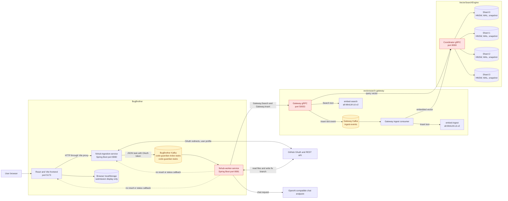

The red components are not necessarily internally broken. They participate in confirmed current integration failures: worker-to-gateway container addressing, embedding dimension mismatch, swallowed commit failures, and incomplete result reporting.

There are two Kafka systems in the checked-in Compose files:

- BugBrother Kafka carries JSON `IndexRepoTask` and `CodeGuardianTask` objects between its ingestion and worker services.
- Gateway Kafka carries protobuf `IngestEvent` objects between `Gateway.Insert` and the gateway ingestion consumer.

They serve separate purposes and use different serialization formats. Documentation elsewhere sometimes suggests sharing one broker, while the current BugBrother Compose file defines its own broker on host port `9094`.

## 3. What is connected and what is absent

| From | To | Current connection | State |
|---|---|---|---|
| Browser | Ingestion service | Relative HTTP URLs proxied by Vite to `http://localhost:8080` | Connected in frontend development mode |
| Browser | GitHub login | Browser follows `/oauth2/authorization/github`, which Spring Security handles | Connected when OAuth credentials and callback are valid |
| Ingestion | BugBrother Kafka | Spring `KafkaTemplate` with JSON serializer | Connected by configuration; send completion is not awaited |
| BugBrother Kafka | Worker | Two `@KafkaListener` methods using JSON deserialization | Connected when both use the same broker |
| Worker | GitHub | `WebClient` with bearer token carried inside each Kafka task | Connected when token has repository access |
| Worker | LLM | Spring AI `ChatClient` | Configured, but provider URL/model compatibility is unverified |
| Worker | Gateway | Java blocking gRPC stub | Connected for host execution if gateway is on `localhost:50053`; broken in current container topology |
| Gateway | Gateway Kafka | Protobuf event published by `kafka-go` | Connected inside gateway stack |
| Gateway consumer | Embedding service | gRPC to `embed-ingest` | Connected inside gateway stack |
| Gateway | Embedding service | gRPC to `embed-search` | Connected inside gateway stack |
| Gateway/consumer | Coordinator | gRPC | Connected in gateway Compose network |
| Coordinator | Four shards | gRPC scatter/gather and deterministic write routing | Connected in gateway Compose network |
| Worker | Ingestion/browser | No callback, WebSocket, status API, result topic, or task database | Missing |
| Frontend | Worker | No direct HTTP or event connection | Missing by design, but no replacement status channel exists |
| Index submission | Search readiness | No acknowledgement from the vector engine back to BugBrother | Missing |

## 4. Frontend flow

### 4.1 Component and function graph

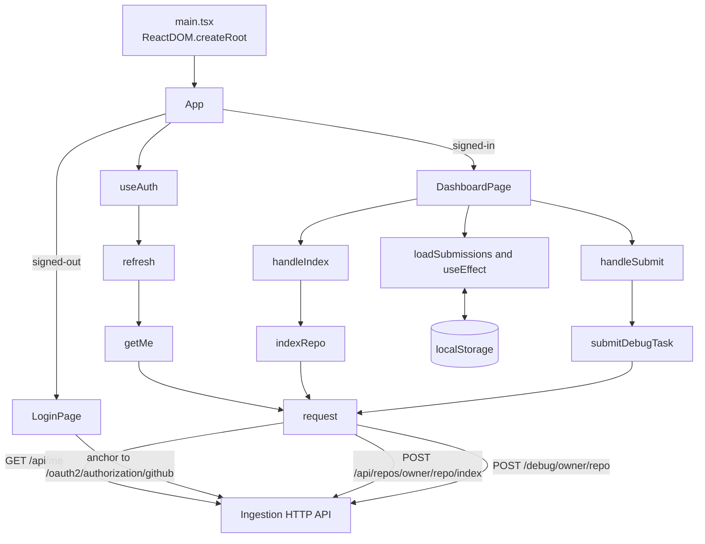

### 4.2 Runtime behavior

1. `main.tsx` mounts `App`.
2. `App` calls `useAuth()` on initial render.
3. `useAuth.refresh()` calls `getMe()`.
4. `getMe()` calls the common `request()` wrapper with `GET /api/me`.
5. `request()` always uses `credentials: 'include'`, allowing the Spring session cookie to travel with same-origin Vite-proxied calls.
6. If the returned object has `authenticated: true` and a username, `App` renders `DashboardPage`; otherwise it renders `LoginPage`.
7. Login is an ordinary browser navigation to `/oauth2/authorization/github`, not an AJAX call.
8. The dashboard collects `owner`, `repo`, and `userQ` as free text. It does not fetch or validate the user's repository list.
9. `handleIndex()` calls `indexRepo()`. A successful HTTP `202` produces a toast saying indexing started. The UI does not know whether the worker received, completed, partially completed, or failed the task.
10. `handleSubmit()` calls `submitDebugTask()`. A successful HTTP `202` produces a toast telling the user to watch GitHub for a branch.
11. The UI creates its own random browser-only submission ID and stores the request in `localStorage`. That ID is never sent to the backend and cannot be used to query real task status.
12. “View branches” opens GitHub's branch search. It is not linked to a branch name returned by the worker.

### 4.3 Vite proxy

`frontend/vite.config.js` proxies these prefixes to `BACKEND_URL`, defaulting to `http://localhost:8080`:

- `/debug`
- `/api`
- `/home`
- `/health`
- `/oauth2`
- `/login`
- `/logout`

This proxy is what joins port `5173` to the ingestion service in development. There is no equivalent frontend service or reverse-proxy configuration in BugBrother's current `docker-compose.yml`.

## 5. Authentication flow

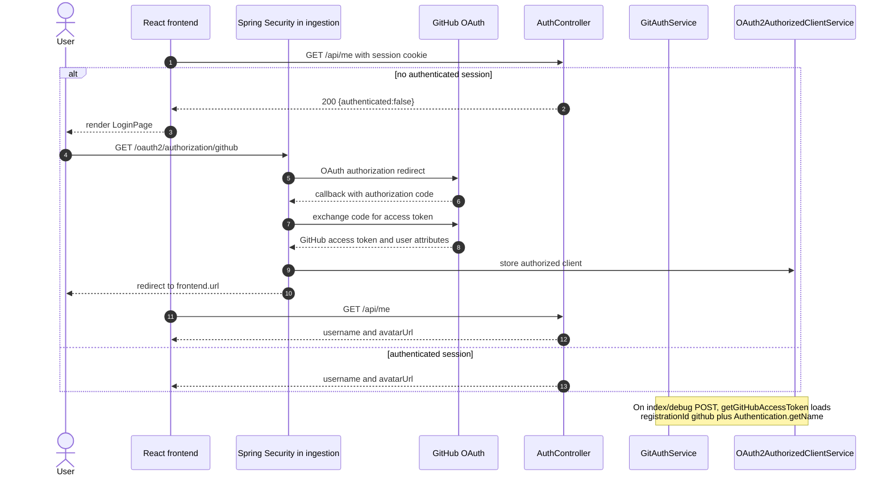

`Oauth.filterChain()` permits `/`, `/health`, and `/api/me`; every other endpoint requires authentication. It enables credentialed CORS for exactly `frontend.url`, converts unauthenticated `/api/**` and `/debug/**` calls to HTTP 401, enables OAuth login/logout redirects, and disables CSRF globally.

The OAuth registration requests `repo,read:user`. The GitHub token is then copied into every Kafka task. The ingestion service has the session; the worker does not. Possession of the task token is how the worker reads and writes the private repository.

## 6. Repository indexing flow

### 6.1 Complete sequence

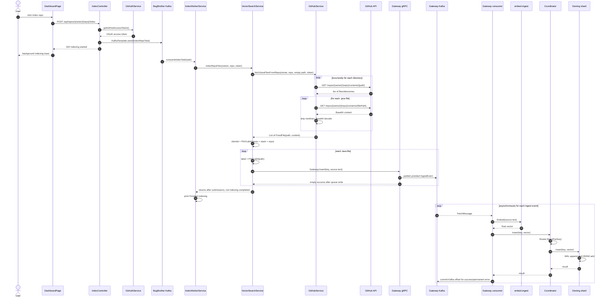

### 6.2 Function chain

```text
DashboardPage.handleIndex
  -> api.indexRepo
    -> api.request
      -> POST /api/repos/{owner}/{repo}/index
        -> IndexController.index
          -> GitAuthService.getGitHubAccessToken
          -> KafkaTemplate.send(IndexRepoTask)
            -> IndexWorkerService.consumeIndexTask
              -> VectorSearchService.indexRepoFiles
                -> GitHubService.fetchJavaFilesFromRepo
                  -> fetchFilesRecursively
                    -> fetchFileContent
                -> clientIdFor -> fnv1a64(owner/repo)
                -> labelFor -> fnv1a64(path)
                -> GatewayBlockingStub.insert
                  -> gateway.Server.Insert
                    -> Limiter.Allow
                    -> IngestProducer.Publish
                      -> Kafka ingest-events
                        -> consumer.processEvent
                          -> embed-ingest.Embed
                          -> coordinator.Server.Insert
                            -> Router.ShardFor
                            -> shard.Server.Insert
                              -> durable.Index.Add
                                -> WAL.Append
                                -> hnsw.Index.Add
                                  -> C hnsw_add
                                    -> C++ Index.addPoint
```

### 6.3 Current failure and ambiguity points

- The ingestion controller does not await the Kafka send future before returning `202`.
- `IndexWorkerService` has no try/catch or status update. `VectorSearchService`, however, catches GitHub and per-file gRPC failures and returns normally, so the worker can print “Finished indexing” after a no-op or partial operation.
- `Gateway.Insert` confirms Kafka publication, not vector availability.
- No task ID or count joins the two asynchronous queues.
- Re-indexing an existing path produces the same `(client_id, label)`. The engine rejects it as `AlreadyExists`, and the gateway consumer classifies that as successful duplicate processing. Changed source therefore keeps the original embedding.
- Removed and renamed files are not reconciled.
- Only `.java` files are fetched.
- Each complete source file is embedded once; long source is truncated by the embedding model.
- The current embed model returns 384 dimensions, but Compose starts 128-dimensional shards. The shard returns `InvalidArgument`; the consumer treats it as permanent and commits/drops the event.

## 7. Debug and fix flow

### 7.1 Complete sequence

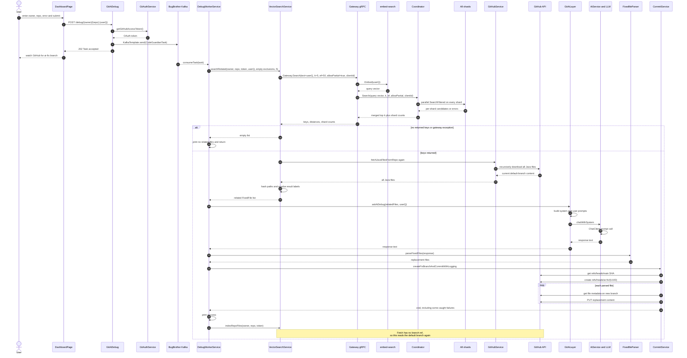

### 7.2 Function chain

```text
DashboardPage.handleSubmit
  -> api.submitDebugTask
    -> api.request
      -> POST /debug/{owner}/{repo}
        -> GitAiDebug.debug
          -> GitAuthService.getGitHubAccessToken
          -> KafkaTemplate.send(CodeGuardianTask)
            -> DebugWorkerService.consumeTask
              -> VectorSearchService.searchRelated
                -> clientIdFor -> fnv1a64(owner/repo)
                -> GatewayBlockingStub.search
                  -> gateway.Server.Search
                    -> Limiter.Allow
                    -> embed-search.Embed
                    -> coordinator.Server.Search
                      -> coordinator.Search
                        -> every shard.Server.Search
                          -> durable.Index.SearchFiltered
                            -> hnsw.Index.SearchFiltered
                              -> C hnsw_search
                                -> C++ Index.search(filterClient=true)
                -> GitHubService.fetchJavaFilesFromRepo
                -> labelFor every current path
                -> map result labels back to FixedFile objects
              -> GitAiLayer.askAiDebug
                -> AiService.chatWithSystem
                  -> Spring AI ChatClient.call.content
              -> FixedfileParser.parseFixedFiles
                -> parseWithOriginalFormat
                -> parseJsonFormat
                -> parseMarkdownFormat
                -> parseSimpleFormat
              -> CommitService.createFixBranchAndCommitWithLogging
                -> getMasterBranchSha
                -> createNewBranch
                -> commitFile for every parsed file
              -> VectorSearchService.indexRepoFiles
```

### 7.3 What the vector result means

The vector engine stores only:

```text
(client_id, label) -> embedding vector
```

For BugBrother:

```text
client_id = FNV-1a 64-bit hash of "owner/repo"
label     = FNV-1a 64-bit hash of repository-relative file path
```

The engine does not store file paths, source text, repository SHA, branch, GitHub repository ID, or owner identity. `searchRelated()` therefore downloads every current Java file from GitHub, hashes every path, and constructs an in-memory `label -> FixedFile` map. It uses that map to translate search results back to source content.

This translation assumes the indexed paths still match the current default branch. Hash collisions are also silently overwritten in the Java map, although a 64-bit collision is unlikely.

### 7.4 Current terminal paths

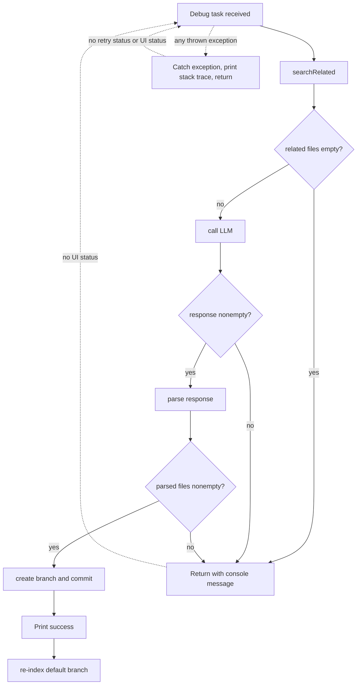

Because `consumeTask()` catches the outer exception itself, failures generally return normally from the Kafka listener. No task record is updated, and the browser continues displaying its locally created “recent submission.”

## 8. AI prompt and parsing flow

`GitAiLayer.askAiDebug(dataList, userQuery)` calls its three-argument overload with an empty `relatedContext`. In the current worker, the vector-retrieved files are passed as `dataList`, meaning the LLM is invited to return replacements for those files.

The prompt assembly is:

```text
userQ + ":\n"
  + "==== File " + path + " ====\n"
  + complete source content
  + ...
```

The system prompt asks the model to emit headers in the form `==== File: <filename> ====`, while the first parser strategy expects `==== File <filename> ====`. The parser then tries four strategies in order:

1. Original header plus Java code fence.
2. A raw JSON array with path/content aliases.
3. Markdown headings ending in `.java` plus code fences.
4. `File:`, `Path:`, or `Filename:` plus a Java code fence.

The fourth strategy can parse the system-prompt format, so the punctuation mismatch is not always fatal. There is no schema-level enforcement, path allowlist, compile/test validation, diff validation, or protection against the model returning unrelated repository paths.

## 9. GitHub commit flow

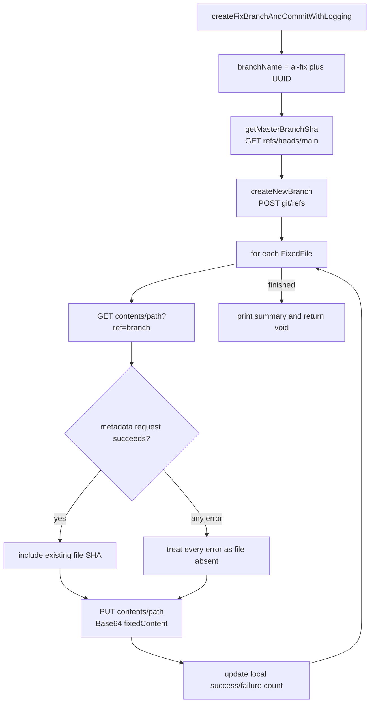

Current consequences:

- The repository's default branch is not discovered; `main` is hardcoded.
- File metadata lookup converts every failure into “file does not exist,” including authorization and server failures.
- Per-file commit failures are caught and counted, but not returned to `DebugWorkerService`.
- Some top-level GitHub API exceptions are logged and swallowed.
- The method returns no branch name, commit IDs, changed-file count, or structured status.
- Each file is committed separately, allowing partial branches.
- The worker prints success after the void method returns.
- The following indexing call reads the default branch, not the new `ai-fix/*` branch.

## 10. Gateway search flow

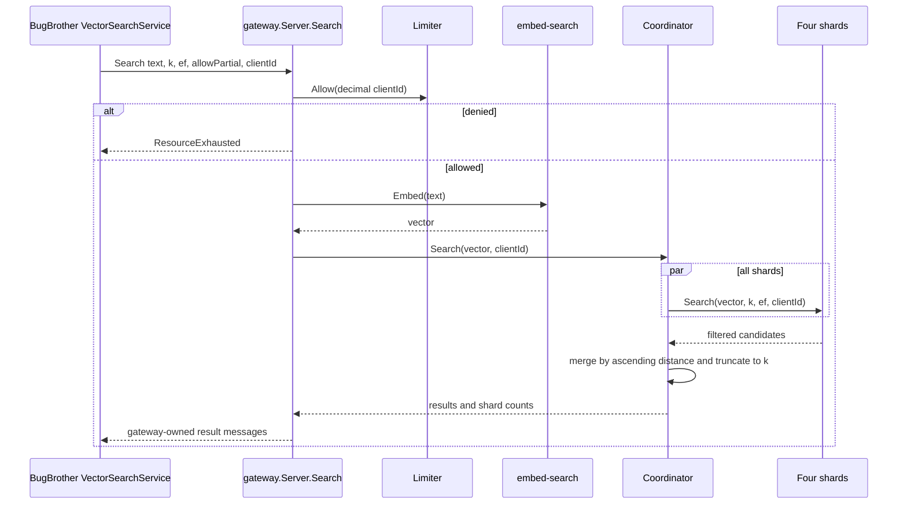

The feature branches correctly forward `client_id` from BugBrother through gateway and coordinator into `SearchFiltered`. The C++ search allows nodes from other clients to participate in graph traversal but admits only the requested client's vectors into results.

BugBrother sets `allowPartial=true` and does not inspect `shardsFailed`. With the current 384-to-128 dimension mismatch, every shard can fail while the coordinator returns a successful empty response. This looks to BugBrother like an unindexed repository.

## 11. Gateway asynchronous insert flow

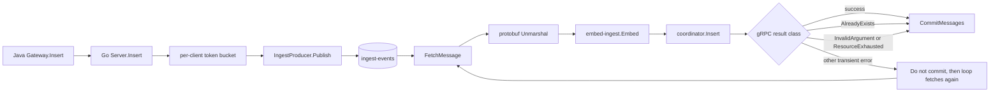

The intended comment says an uncommitted transient failure will be redelivered. The actual loop fetches another message immediately. A later commit on the same partition can advance the committed offset beyond the failed record, so this is not a reliable retry loop.

The gateway rate limiter uses one token bucket for both search and insert, keyed by decimal `client_id`, with capacity 10 and refill 1 token/second. Bulk indexing can therefore contend with interactive searches and can receive `ResourceExhausted`. BugBrother logs/skips failed file inserts without retrying.

## 12. Vector engine flow

### 12.1 Write path

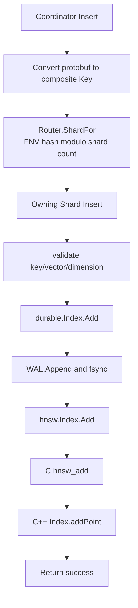

Only one shard receives each write. Each shard owns its own C++ HNSW index, WAL, and periodic snapshot. The composite key is `(clientID, label)`.

### 12.2 Read path

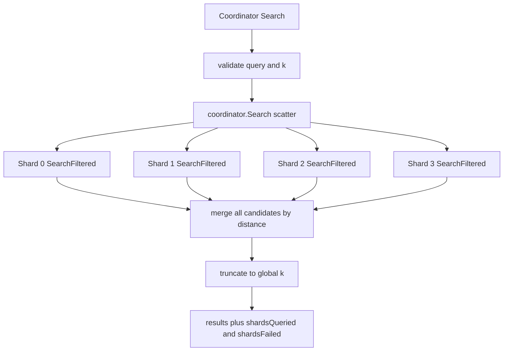

When `allowPartial=false`, one shard error aborts the search. When `allowPartial=true`, failed shards contribute no candidates, and the response records the failure count.

### 12.3 Persistence path

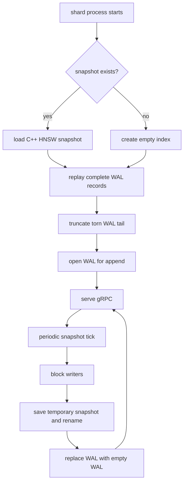

## 13. Data contracts crossing processes

### Frontend to ingestion

```json
{
  "userQ": "NullPointerException at Foo.java:42"
}
```

Owner and repository are URL path segments.

### Ingestion to worker: debug task

```text
CodeGuardianTask {
  owner: String,
  repo: String,
  payload: ResponsePayload { userQ: String },
  token: String
}
```

### Ingestion to worker: indexing task

```text
IndexRepoTask {
  owner: String,
  repo: String,
  token: String
}
```

### BugBrother worker to gateway

```text
GatewayInsertRequest {
  key { client_id: uint64, label: uint64 },
  text: String
}

GatewaySearchRequest {
  text: String,
  k: uint32,
  ef: uint32,
  allow_partial: bool,
  client_id: uint64
}
```

### Gateway to its Kafka consumer

```text
IngestEvent {
  key { client_id: uint64, label: uint64 },
  content: String
}
```

### Gateway/consumer to engine coordinator

```text
InsertRequest { key, repeated float vector }
SearchRequest { repeated float query, k, ef, allow_partial, client_id }
```

## 14. Deployment topology as currently configured

### 14.1 BugBrother Compose

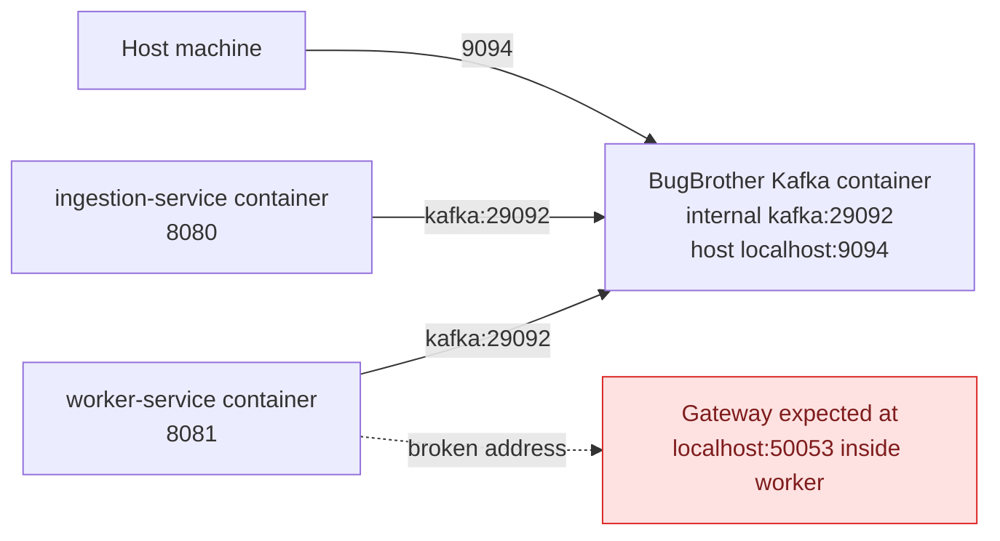

The current Compose file does not define the frontend. It also does not join the worker to the gateway's `vsgw` network or set `VECTORSEARCH_GATEWAY_HOST`. Therefore the worker's default `localhost:50053` targets itself.

### 14.2 Gateway Compose

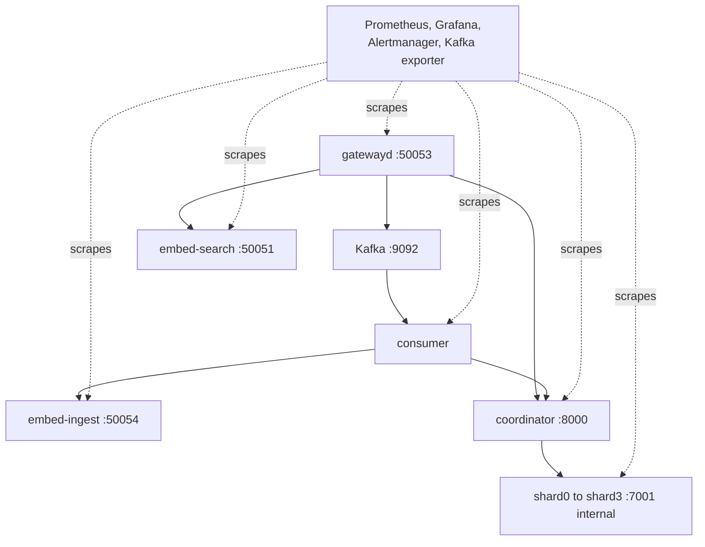

Gateway Compose builds the coordinator and shards directly from the sibling `VectorSearchEngine` checkout using `VSE_PATH`. It configures each shard with dimension 128 while both embedding containers load a 384-dimensional model.

### 14.3 Host-development configuration conflict

The gateway root `.env` points `COORDINATOR_ADDR` to `localhost:8000`, while `go/.env` points it to `localhost:50052`. Because both Go entrypoints call `godotenv.Load(".env")`, the effective file depends on the process working directory. Running `go run .` from `go/` uses the stale `50052` value.

## 15. Function ownership map

| Function/class | Repository and file | Calls or owns |
|---|---|---|
| `App` | `BugBrother/frontend/src/App.tsx` | Selects login/dashboard using `useAuth` state |
| `useAuth.refresh` | `frontend/src/hooks/useAuth.ts` | Calls `getMe`; maps failures to signed-out state |
| `request` | `frontend/src/api/client.ts` | Shared credentialed fetch and non-2xx conversion |
| `DashboardPage.handleIndex` | `frontend/src/pages/DashboardPage.tsx` | Calls `indexRepo`, shows acceptance toast |
| `DashboardPage.handleSubmit` | same | Calls `submitDebugTask`, writes browser-only submission history |
| `Oauth.filterChain` | ingestion `config/Oauth.java` | Security rules, OAuth redirects, CORS, logout, CSRF disablement |
| `AuthController.me` | ingestion controller | Reads Spring authentication and returns UI identity |
| `GitAuthService.getGitHubAccessToken` | ingestion service | Loads GitHub authorized client from current session |
| `IndexController.index` | ingestion controller | Validates path variables, gets token, queues `IndexRepoTask` |
| `GitAiDebug.debug` | ingestion controller | Validates `userQ`, gets token, queues `CodeGuardianTask` |
| `IndexWorkerService.consumeIndexTask` | worker service | Kafka listener invoking repository indexing |
| `DebugWorkerService.consumeTask` | worker service | Orchestrates search, LLM, parse, commit, re-index |
| `GitHubService.fetchJavaFilesFromRepo` | worker service | Recursively downloads `.java` files from GitHub default branch |
| `VectorSearchService.indexRepoFiles` | worker service | Hashes repo/path identifiers and calls `Gateway.Insert` per file |
| `VectorSearchService.searchRelated` | worker service | Calls `Gateway.Search`, re-downloads files, resolves labels |
| `GitAiLayer.askAiDebug` | worker wrapper | Constructs prompts from selected source files |
| `AiService.chatWithSystem` | worker service | Calls Spring AI `ChatClient` |
| `FixedfileParser.parseFixedFiles` | worker parser | Tries four response parsing formats |
| `CommitService.createFixBranchAndCommitWithLogging` | worker service | Creates UUID branch and writes parsed files |
| `gateway.Server.Search` | gateway `go/gateway/server.go` | Rate limit, embed query, coordinator search, result conversion |
| `gateway.Server.Insert` | same | Rate limit and enqueue protobuf ingest event |
| `IngestProducer.Publish` | gateway `go/gateway/producer.go` | Protobuf marshal and Kafka write keyed by client ID |
| `processEvent` | gateway consumer | Unmarshal, embed source, coordinator insert, classify offset action |
| `coordinator.Server.Insert` | engine | Routes write to one shard |
| `coordinator.Server.Search` | engine | Validates request and invokes scatter/gather search |
| `coordinator.Search` | engine `go/coordinator/gather.go` | Parallel full-k shard calls and global merge |
| `shard.Server.Insert` | engine | Dimension validation and durable insert |
| `shard.Server.Search` | engine | Calls client-filtered durable search |
| `durable.Index.Add` | engine | WAL-before-HNSW mutation |
| `durable.Index.Snapshot` | engine | Blocks writes, saves snapshot, rotates WAL |
| `hnsw.Index.SearchFiltered` | engine Go binding | Calls C ABI with client filter enabled |
| `Index::search` | engine C++ | HNSW traversal and client-filtered result admission |

## 16. Observability that currently exists

The vector stack exposes Prometheus metrics for gateway gRPC calls, rate limits, Kafka publishing, consumer processing, embeddings, coordinator-to-shard calls, HNSW capacity, and snapshots. Grafana and alert definitions exist in gateway Compose.

BugBrother does not expose equivalent workflow metrics or persistent job state. Its operational signals are primarily console output. There is no correlation ID spanning browser request, BugBrother Kafka task, gateway inserts, vector records, LLM call, and GitHub branch.

## 17. Current state summary

The browser and ingestion service are connected for authentication and task acceptance. The ingestion and worker services are connected through Kafka when they use the same broker. The worker code contains the intended search, AI, and commit orchestration. The feature branches correctly implement repository-scoped vector search.

The complete workflow is still not closed:

1. The frontend receives acceptance, not completion.
2. No backend task status links the worker result to the browser.
3. Containerized worker-to-gateway addressing is absent.
4. The embedding and shard dimensions are incompatible.
5. Index submissions have no searchable-readiness acknowledgement.
6. Existing file embeddings cannot be updated with the current duplicate-key behavior.
7. Commit failures can be swallowed and presented as success in worker logs.
8. The post-fix indexing call reads the default branch instead of the generated fix branch.
9. Current BugBrother behavior depends on uncommitted local files.

The detailed defect analysis and repair order are in [`THREE_PROJECT_AUDIT.md`](./THREE_PROJECT_AUDIT.md). This document is the companion call map: it records how the current code moves control and data through every service.
